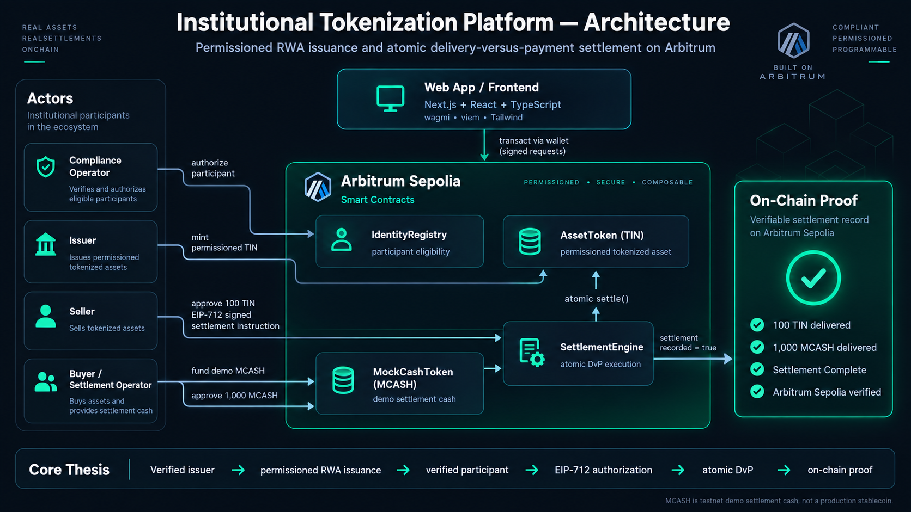

# Institutional Tokenization Platform

A permissioned real-world asset infrastructure prototype for **regulated token issuance and atomic Delivery-versus-Payment (DvP) settlement on Arbitrum**.

**Live app:** https://institutional-tokenization-platform.vercel.app  
**Network:** Arbitrum Sepolia (`421614`)  
**Primary category:** RWA  
**Secondary category:** DeFi

> **Verified issuer → permissioned RWA issuance → verified participant → EIP-712 authorization → atomic DvP → on-chain proof.**



---

## What It Demonstrates

Institutional digital-asset workflows require more than an ERC-20 transfer. They need participant eligibility, controlled issuance, explicit authorization, deterministic settlement, and verifiable post-trade state.

This project models that workflow as a modular smart-contract system:

1. A compliance operator authorizes an eligible participant.
2. An issuer mints a permissioned tokenized asset.
3. Demo settlement cash is funded for the buyer.
4. Seller and buyer approve the SettlementEngine for their respective settlement legs.
5. The seller signs the exact settlement instruction using **EIP-712 typed structured data**.
6. An authorized settlement operator executes `settle(...)`.
7. The SettlementEngine transfers the asset and cash legs **atomically**.
8. The settlement ID is recorded to prevent replay or duplicate execution.

If either leg fails, the entire transaction reverts.

---

## Live Hackathon Proof

The production frontend is deployed and connected to contracts on **Arbitrum Sepolia**.

### Successful UI-Driven DvP

**Settlement ID:** `arbitrum-open-house-ui-demo-001`

**Trade**
- Seller delivered: `100 TIN`
- Buyer delivered: `1,000 MCASH`
- Execution: atomic through `SettlementEngine`
- Seller authorization: EIP-712 typed-data signature

**Verified settlement transaction**

[`0xa521817b833d37587588d0f93438a32b61d5fd6c60ce1e479c739116b4d63926`](https://sepolia.arbiscan.io/tx/0xa521817b833d37587588d0f93438a32b61d5fd6c60ce1e479c739116b4d63926)

### Verified Final State

| State | Result |
|---|---:|
| Seller TIN | `100` |
| Seller MCASH | `2000` |
| Buyer TIN | `100` |
| Buyer MCASH | `0` |
| Seller TIN allowance to SettlementEngine | `0` |
| Buyer MCASH allowance to SettlementEngine | `0` |
| Settlement recorded | `true` |

`MCASH` is **testnet demo settlement cash** used to model the cash leg. It is not a production stablecoin or deposit token.

---

## Architecture

The system separates compliance state, asset ownership, settlement cash, and execution logic into distinct modules.

### `IdentityRegistry`

Maintains minimal on-chain participant authorization state.

Responsibilities:
- authorize participants
- revoke participants
- expose authorization status to other contracts
- restrict compliance actions using role-based access control
- emit authorization and revocation events

Sensitive KYC information is intentionally **not stored on-chain**. The registry stores only whether an address is currently authorized.

### `AssetToken`

A permissioned ERC-20 representing a tokenized financial asset.

Responsibilities:
- role-controlled issuance
- issuer-controlled burning
- transfers between authorized participants
- transfer restrictions based on `IdentityRegistry`
- emergency pause/unpause controls

The token delegates eligibility decisions to the registry instead of duplicating compliance state.

### `MockCashToken`

A development-only ERC-20 used to model the cash leg of settlement.

It can represent the settlement behavior of instruments such as:
- tokenized deposits
- regulated stablecoins
- wholesale settlement tokens

It is **not** a production stablecoin implementation.

### `SettlementEngine`

Coordinates atomic exchange between a tokenized asset and an ERC-20 cash leg.

A settlement instruction contains:

```solidity
struct SettlementInstruction {
    bytes32 settlementId;
    address seller;
    address buyer;
    address assetToken;
    address cashToken;
    uint256 assetAmount;
    uint256 cashAmount;
}
```

The seller signs the exact instruction using EIP-712. An authorized settlement operator then submits:

```solidity
settle(instruction, signature)
```

Before execution, the engine verifies:
- required fields are non-zero
- caller holds `SETTLER_ROLE`
- the EIP-712 signature resolves to the seller
- the settlement ID has not already been executed

It then performs both token transfers inside the same EVM transaction.

---

## Atomic Delivery-versus-Payment

The core settlement invariant is:

> **The asset transfer and cash transfer must either both succeed or both fail.**

Conceptually:

```text
Seller                         Buyer
  │                              │
  │────── 100 TIN ──────────────►│
  │                              │
  │◄──── 1,000 MCASH ────────────│
  │                              │
  └──── same EVM transaction ────┘
```

If either transfer fails, the transaction reverts and there is no partial settlement state.

---

## EIP-712 Settlement Authorization

The EIP-712 domain binds the seller's signature to:
- protocol name
- protocol version
- chain ID
- deployed `SettlementEngine` address

The seller therefore authorizes the **exact settlement instruction**, not a generic token movement.

The current version uses seller-side cryptographic authorization. Buyer approval of the cash token permits transfer of the cash leg but is not treated as a bilateral signature over the full settlement terms.

---

## Permission Model

The platform separates operational responsibilities with OpenZeppelin `AccessControl`.

| Role | Responsibility |
|---|---|
| `DEFAULT_ADMIN_ROLE` | Administrative role management |
| `COMPLIANCE_ROLE` | Participant authorization and revocation |
| `ISSUER_ROLE` | Asset issuance and redemption/burning |
| `PAUSER_ROLE` | Emergency asset-transfer controls |
| `SETTLER_ROLE` | Submission of settlement transactions |

This models institutional least-privilege principles and avoids concentrating every operational capability in one actor.

---

## Security Properties

The implementation focuses on explicit security guarantees:

- **Permissioned transfers** — asset movement is restricted by participant eligibility.
- **Signed instructions** — settlement terms are cryptographically bound to the seller with EIP-712.
- **Replay protection** — each settlement uses a unique `settlementId`.
- **Atomicity** — asset and cash legs succeed or revert together.
- **Reentrancy protection** — settlement execution uses OpenZeppelin `ReentrancyGuard`.
- **Safe ERC-20 interaction** — token transfers use `SafeERC20`.
- **Emergency controls** — permissioned asset movement can be paused.
- **Minimal identity state** — no personal KYC records are stored on-chain.

---

## Arbitrum Sepolia Deployment

| Contract | Address |
|---|---|
| `IdentityRegistry` | [`0x1B6e4b00F58269dFb8a8954B2a1Fd17bfE3593E7`](https://sepolia.arbiscan.io/address/0x1B6e4b00F58269dFb8a8954B2a1Fd17bfE3593E7) |
| `AssetToken` | [`0x8E27fb322ab06B890657B640B59b7870Db813c59`](https://sepolia.arbiscan.io/address/0x8E27fb322ab06B890657B640B59b7870Db813c59) |
| `MockCashToken` | [`0xe504Fd4568aDC3AcCd147d0b7848743F85Ae920f`](https://sepolia.arbiscan.io/address/0xe504Fd4568aDC3AcCd147d0b7848743F85Ae920f) |
| `SettlementEngine` | [`0x435D03aC40aDC9c502d2Bed8B3B3F15862ECA9F6`](https://sepolia.arbiscan.io/address/0x435D03aC40aDC9c502d2Bed8B3B3F15862ECA9F6) |

---

## Frontend

The production interface exposes the institutional workflow directly:

1. **Compliance** — inspect and authorize participant eligibility
2. **Issuance** — mint permissioned tokenized assets
3. **Settlement Preparation** — fund demo cash and approve both settlement legs
4. **Final Settlement** — sign and execute atomic DvP
5. **On-Chain Proof** — inspect protocol state and transaction evidence

### Frontend Stack

- Next.js
- React
- TypeScript
- wagmi
- viem
- TanStack Query
- Tailwind CSS

---

## Smart-Contract Stack

- Solidity `0.8.34`
- Hardhat `3`
- TypeScript
- ethers.js `6`
- OpenZeppelin Contracts
- EIP-712
- ECDSA
- ERC-20
- AccessControl
- SafeERC20
- ReentrancyGuard
- Pausable
- Mocha
- Chai

---

## Testing

The project contains **70 passing tests** covering unit and integration behavior.

```bash
npx hardhat test
```

Coverage includes:
- identity authorization and revocation
- compliance-role enforcement
- role revocation
- permissioned minting
- permissioned transfers
- issuer-controlled burning
- emergency pause behavior
- settlement validation
- settlement-role enforcement
- EIP-712 seller authorization
- atomic asset/cash exchange
- insufficient asset balances
- insufficient cash balances
- missing token approvals
- revoked buyers and sellers
- paused assets
- settlement replay protection
- transaction rollback behavior

The integration suite verifies that the contracts behave correctly as a system rather than only in isolation.

---

## Run Locally

### Smart Contracts

```bash
npm install
npx hardhat test
```

Run the reproducible local demo:

```bash
npx hardhat run scripts/demo.ts
```

### Frontend

```bash
cd frontend
npm install
npm run dev
```

Then open the local Next.js development server shown in the terminal.

---

## Repository Structure

```text
contracts/
├── core/
│   ├── AssetToken.sol
│   ├── IdentityRegistry.sol
│   └── SettlementEngine.sol
├── interfaces/
│   ├── IIdentityRegistry.sol
│   └── ISettlementEngine.sol
└── mocks/
    └── MockCashToken.sol

frontend/
├── app/
└── components/

test/
├── AssetToken.ts
├── IdentityRegistry.ts
├── MockCashToken.ts
├── SettlementEngine.ts
└── SettlementIntegration.ts

deployments/
└── arbitrum-sepolia.json

docs/
└── architecture.png
```

---

## Design Principles

**Modular state ownership**  
Each contract owns a narrow category of state.

**Minimal dependencies**  
Contracts depend only on the interfaces required to perform their responsibilities.

**No duplicated compliance state**  
`AssetToken` queries `IdentityRegistry` rather than maintaining its own authorization mapping.

**Least privilege**  
Administrative, compliance, issuance, emergency, and settlement responsibilities are separated.

**Minimal on-chain identity data**  
The protocol does not place full KYC records on-chain.

**No premature upgradeability**  
The current version is intentionally non-upgradeable so trust assumptions and execution paths remain explicit.

**Focused protocol surface**  
The project intentionally avoids unrelated DeFi features such as AMMs, yield farming, lending pools, governance tokens, or retail trading functionality.

---

## Current Scope

The hackathon MVP demonstrates:

```text
Participant Authorization
        ↓
Permissioned RWA Issuance
        ↓
Settlement Preparation
        ↓
EIP-712 Seller Authorization
        ↓
Atomic Asset / Cash Settlement
        ↓
Replay Protection
        ↓
On-Chain Proof
```

This is a focused reference implementation for institutional digital-asset infrastructure, not a complete production financial system.

---

## Non-Goals

The current version does not attempt to implement:
- complete KYC/AML infrastructure
- custody infrastructure
- production stablecoins or deposit tokens
- privacy-preserving identity
- cross-chain settlement
- proxy upgradeability
- order books or matching engines
- AMMs
- lending markets
- yield farming
- governance tokens
- complex corporate actions
- production key-management infrastructure

Those concerns require additional operational, legal, security, and infrastructure assumptions beyond the scope of this MVP.

---

## Status

**Hackathon milestone: permissioned RWA issuance + interactive signed atomic DvP settlement on Arbitrum Sepolia**

- IdentityRegistry implemented
- Permissioned AssetToken implemented
- Mock settlement cash implemented
- Role-based controls implemented
- Emergency pause controls implemented
- SettlementEngine implemented
- SafeERC20 settlement implemented
- Reentrancy protection implemented
- EIP-712 seller authorization implemented
- Settlement replay protection implemented
- Atomic DvP integration tests implemented
- Interactive frontend workflow implemented
- Arbitrum Sepolia deployment live
- UI-driven settlement successfully executed on-chain
- 70 tests passing
